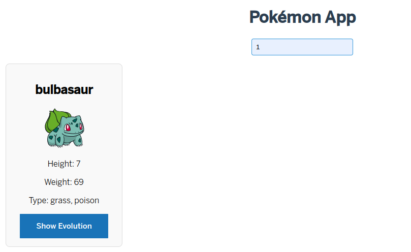

# @meraki/pokemon-dm

## Package info

This package provides the `PokemonDm` component, a custom LitElement-based element that handles the logic for viewing and searching information about Pokémon using the PokéAPI.

### Package installation

Installation using NPM

```bash
npm install @meraki/pokemon-dm
```

packege.json:  "dependencies": {
    "@meraki/pokemon-dm": "version"
  },
 
```bash
npm install 
``` 

### Prerequisites

- Node.js v14+
- LitElement v2+
- Access to the PokéAPI for real-time data consumption

### Entry points & exports

- (Default entry point)
  - PokemonDm (Class)
- pokemon-dm.js
  - pokemon-dm (Custom Element)


## PokemonDm (Class) pokemon-dm (Custom Element) 

### Extends from

LitElement (lit-element package)

### Usage

Import and extend the class:

```js
import { PokemonDm } from '@meraki/pokemon-dm';

class ExampleElement extends PokemonDm {
  ...
}
```

Use the custom element (defined globally):

```js
import '@meraki/pokemon-dm/pokemon-dm.js';

async firstUpdated() {
        const queryScope = this.shadowRoot || this;
        this._dm = queryScope.querySelector('pokemon-dm');
        await this._dm.fetchPokemons();
        this.updateState();
}
```

```html
<pokemon-dm ...>
  ...
</pokemon-dm>
```

### Description


The PokemonDm component is a custom web component built with LitElement that manages the logic for searching, listing, and displaying Pokémon details. It allows users to search for Pokémon by name or ID and view their evolution chains when available. The component interacts with the PokéAPI to fetch relevant data, providing essential features such as pagination, evolution views.
Example:

```js
async handleInput(ev) {
        this.searchQuery = ev.target.value;
        this.updateState();
        await this._dm.searchPokemons()
        this.updateState();
    }
```

```html
  <div class="search-bar">
    <input id="searchInput" type="text" placeholder="Search by ID or Name" @input="${this.handleInput}">
  </div>
  <pokemon-dm></pokemon-dm>
```



### Properties

- **pokemons**: `Array`  
  _(type: Array)_  
  Description: List of all available Pokémon.

  - **currentPage**: `number`  
  _(type: Number)_  
  Description: Current page number in the list of results.

- **totalPokemons**: `number`  
  _(type: Number)_  
  Description: Total number of Pokémon available in the database.

- **perPage**: `number`  
  _(type: Number)_  
  Description: Number of Pokémon displayed per page.

  This README provides a detailed overview of the PokemonDm component, outlining its functionality for managing Pokémon data. It covers the component's logic for searching, listing, and retrieving evolution information, as well as its integration with the PokéAPI. Key features include event handling, property configuration, and methods for efficient data management.